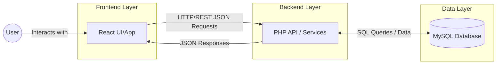
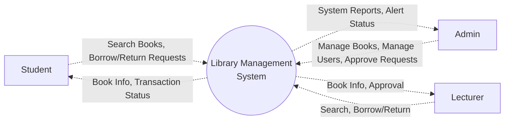
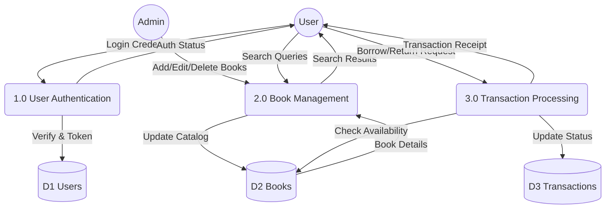
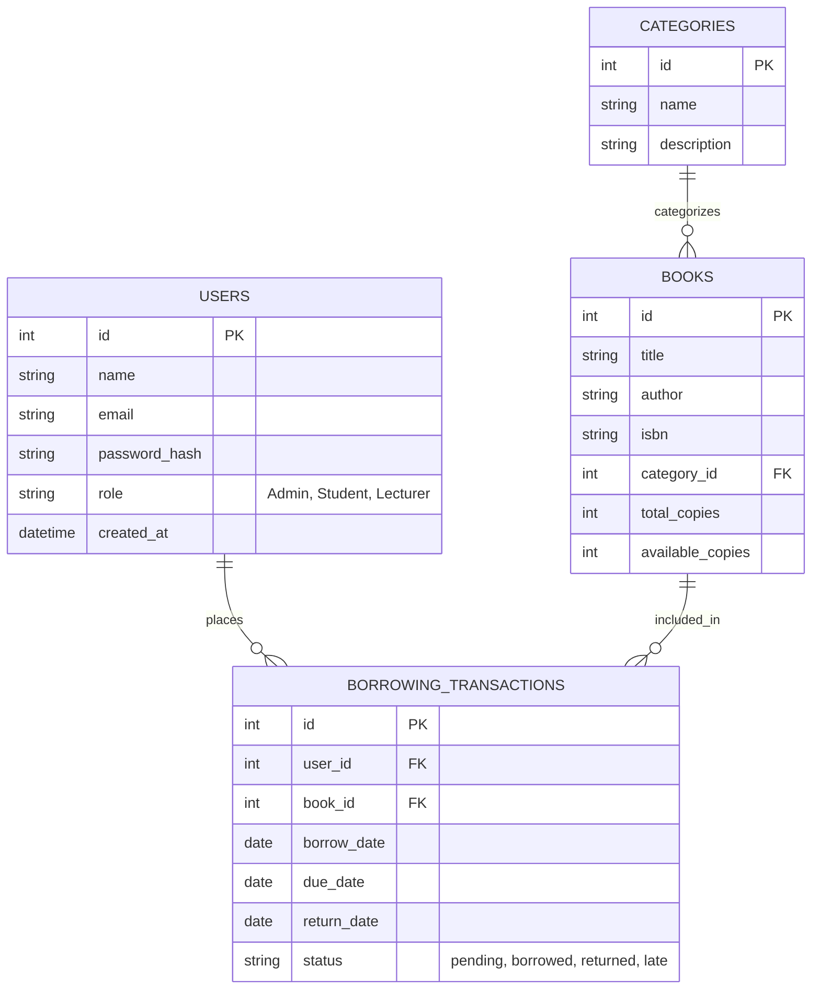
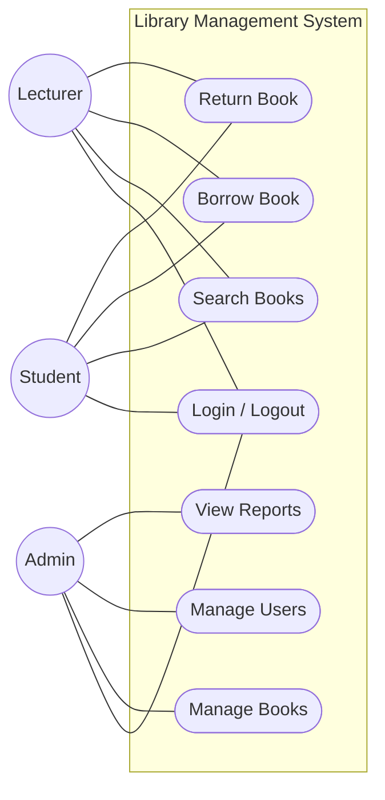
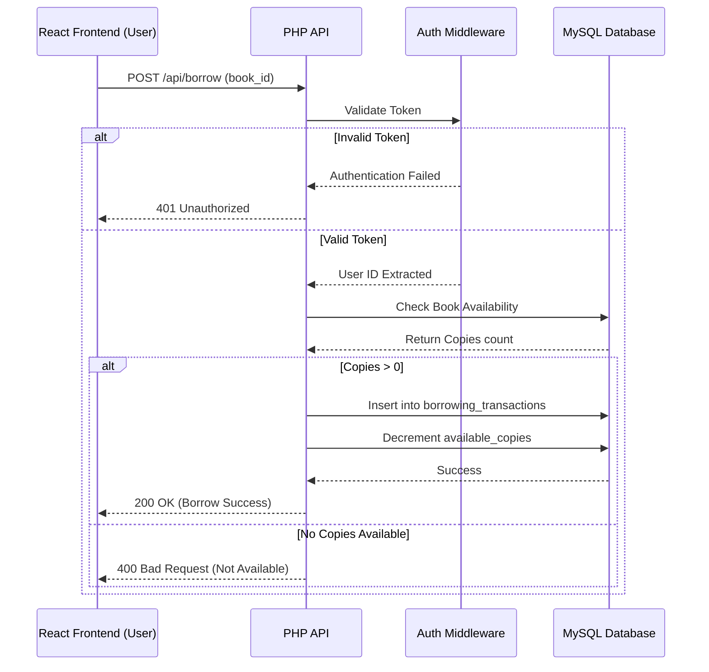
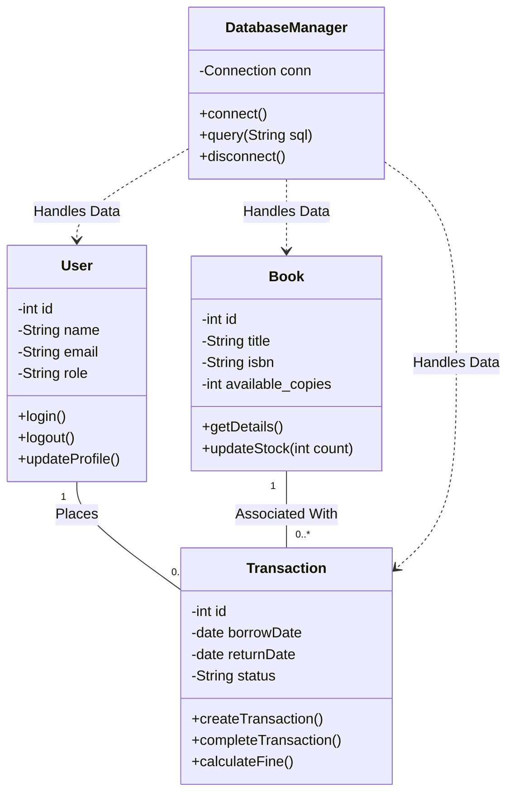

# Library Management System Design Documents

This document contains the structural and behavioral diagrams for the modern React-based Library Management System.

## 1. Conceptual Diagram (System Architecture)

---

## 2. Data Flow Diagram (DFD)

### Context Diagram (Level 0)

### Level 1 DFD

---

## 3. Entity-Relationship Diagram (ERD)

---

## 4. Unified Modelling Language (UML) Diagrams

### Use Case Diagram

### Sequence Diagram (Book Borrowing Process)

### Class Diagram

